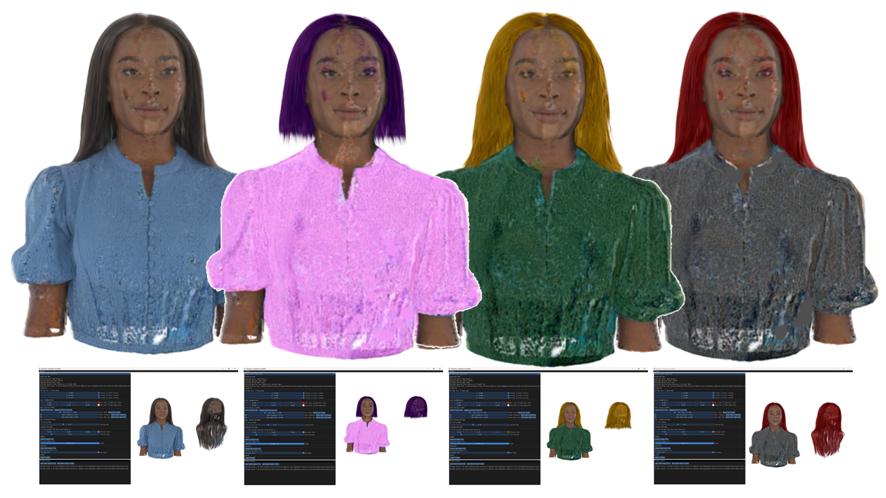
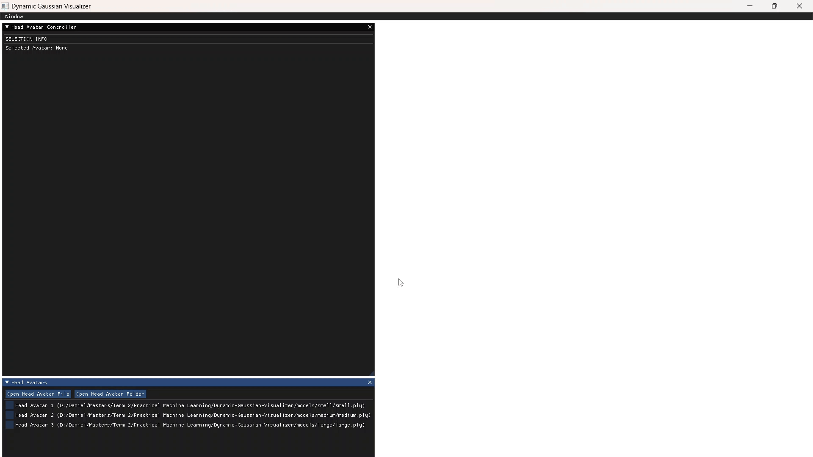
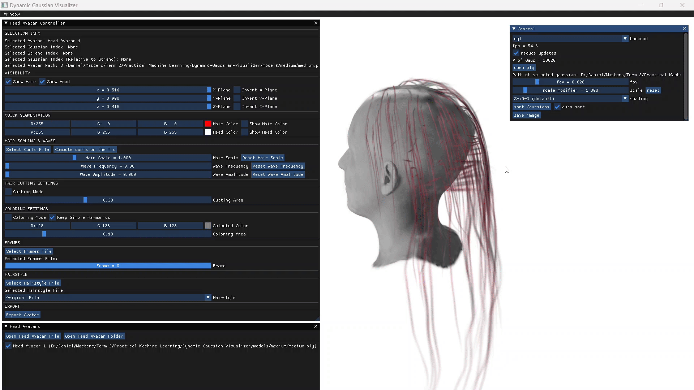
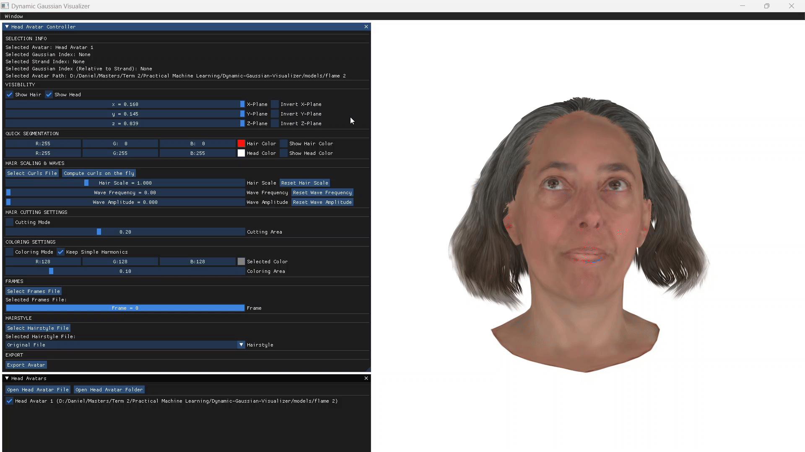

## Dynamic Gaussian Visualizer



Dynamic Gaussian Visualizer is a lightweight and specialized tool for visualizing dynamic Gaussian splatting models of human heads with hair. Optimized for compatibility with models referenced in _(paper)_, it enables users to explore and manipulate intricate head models with dynamic hair effects. It uses PyOpenGL, keeps dependencies minimal, and does not require a CUDA GPU.

## Quick Start

Clone the repository:

```bash
git clone https://github.com/Daniel-Eskandar/Dynamic-Gaussian-Visualizer.git
```

Install dependencies:

```bash
pip install -r requirements.txt
```

Launch viewer:

```bash
python main.py
```

Refer to the help window for GUI instructions.

## Models

The Gaussian file loader is compatible with the official implementation and works best with models as described in _(paper)_. Sample models can be downloaded from [here](https://drive.google.com/file/d/1xwkqxQoLfkvDqnNHPqKXFU2KNDkx6-Ad/view?usp=drive_link).

For hair strand files, ensure the gaussians' means, scales, and rotations are the first rows in the `.ply` file. To save the number of hair strands (`n_strands`) and the number of gaussians per strand (`n_gaussians_per_strand`), run the following command:

```bash
python utils/util.py my_path --n_strands=12000 --n_gaussians_per_strand=31
```

To load precomputed rotation matrices for curls (instead of computing them on the fly), use the following command:

```bash
python utils/frenet_arcle.py my_path n_samples=10 --n_clusters=2 --max_amp=0.025 --max_freq=3
```

-   `n_samples`: Number of evenly spaced values for both amplitude and frequency.
-   `max_amp`: Maximum value for amplitude (inclusive).
-   `max_freq`: Maximum value for frequency (inclusive).
-   `n_clusters`: Number of hair clusters, each with strands sharing the same frequency and curling behavior.

For faster loading of frames and reduced read operations, run the following script:

```bash
python utils/frame_packer.py my_path --rot_format {quat, mat}
```

It takes the directory containing the files `frame_#_mean_frenet.npy`, `frame_#_rot_frenet.npy` , and `frame_#_scale_frenet.npy`. Specify whether the rotation is represented as a quaternion or rotation matrix (quat or mat).

Finally, to load FLAME Gaussian models, use the `Open Head Avatar from Folder` button. The folder should contain two `.ply` files:

-   `hair.ply`: Contains the hair Gaussian data (with `n_strands` and `n_gaussians_per_strand`).
-   `head.ply`: Contains the head Gaussian data.

## Features

1. Load and display multiple avatars
   

2. Axes view renderer
   

3. Toggle hair and head visibility
   

4. Hair coloring
   

5. Hair cutting
   

6. Curly hair effect
   

7. Hair dynamics
   

8. Hairstyle swapping
   

9. FLAME control
   

## Acknowledgements

-   The foundation for this work is based on the original repository [GaussianSplattingViewer](https://github.com/limacv/GaussianSplattingViewer).
-   Code for binding Gaussian files with the FLAME model was sourced from the [GaussianAvatars](https://github.com/ShenhanQian/GaussianAvatars) repository.
